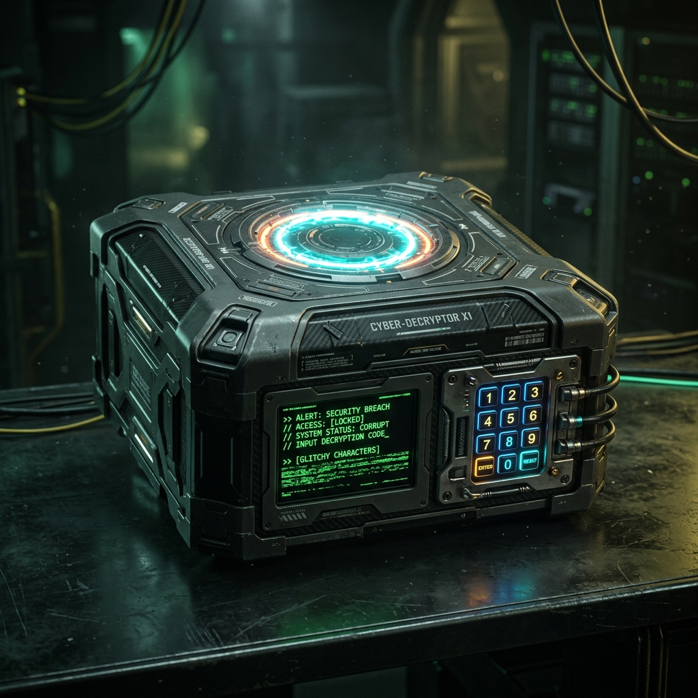

# ⬡ THE BOX — Smart Escape Box (v2.0)

[](https://opensource.org/licenses/MIT)
[](https://www.espressif.com/en/products/socs/esp32-s3)
[](https://platformio.org/)



> **"Protocoles chargés. Système prêt. L'évasion commence maintenant."**

**The Box** est une console de puzzle immersive basée sur l'ESP32-S3, conçue pour offrir une expérience d'Escape Game AAA à domicile. Alliant hardware complexe et interface web ultra-réactive, elle défie les joueurs à travers 5 niveaux de sécurité croissants.

---

## ⚡ Caractéristiques Principales

*   **⚡ Dual-Core Engine** : Architecture FreeRTOS optimisée. Cœur 0 pour le réseau (WebSockets) et Cœur 1 pour la logique de jeu (60 FPS).
*   **🖥️ Interface Web Terminal** : UI mobile en temps réel (Dark Mode, Glassmorphism) servant d'assistant tactique à l'agent.
*   **🧩 5 Protocoles de Sécurité** :
    1.  **Onboarding** : Calibration système.
    2.  **Maze Runner** : Navigation sonar et joystick.
    3.  **Radio Signal** : Décodage de fréquences.
    4.  **Gesture Bio-Lock** : Mémorisation de séquences.
    5.  **Final Liberation** : Déverrouillage multi-capteurs.
*   **🔊 Feedback Immersif** : Moteur sonore polyphonique et système de LEDs RGB synchronisé.

---

## 🛠️ Stack Technique

| Composant | Technologie |
| :--- | :--- |
| **Microcontrôleur** | ESP32-S3 (Dual Core, 16MB Flash, 8MB PSRAM) |
| **Firmware** | C++17 / PlatformIO / FreeRTOS |
| **Affichage** | LovyanGFX (ST7789 240x240) |
| **Réseau** | WebSockets (AsyncTCP) / WebServer local |
| **Interface Web** | Vanilla JS / CSS3 (Aesthetic: Futuristic Dark Terminal) |

---

## 📂 Structure du Projet

```bash
├── assets/           # Images et ressources marketing
├── data/             # Contenu LittleFS (Web UI & Quiz JSON)
├── docs/             # Schémas de câblage et manuel technique
├── firmware/         # Projet PlatformIO (Code Source)
│   ├── src/
│   │   ├── engine/   # Moteurs Display, RGB, Buzzer
│   │   ├── fsm/      # Machine à états finis du jeu
│   │   ├── network/  # Gestionnaire WebSocket
│   │   └── sensors/  # Abstraction des capteurs
└── platformio.ini    # Configuration de build
```

---

## 🚀 Installation Rapide

1.  **Clonez le dépôt** :
    ```bash
    git clone https://github.com/rayanekes/the-box-esp32.git
    ```
2.  **Ouvrez avec PlatformIO** (VS Code).
3.  **Uploadez le Filesystem** : `Run Task: Upload Filesystem Image` (pour `data/`).
4.  **Uploadez le Firmware**.
5.  **Connectez-vous** au point d'accès Wi-Fi `EscapeBox` et accédez à `http://192.168.4.1`.

---

## 📜 Licence

Distribué sous licence MIT. Voir `LICENSE` pour plus d'informations.

---

<p align="center">
  <i>Développé avec passion par <b>rayanekes</b> & <b>Antigravity</b></i>
</p>
